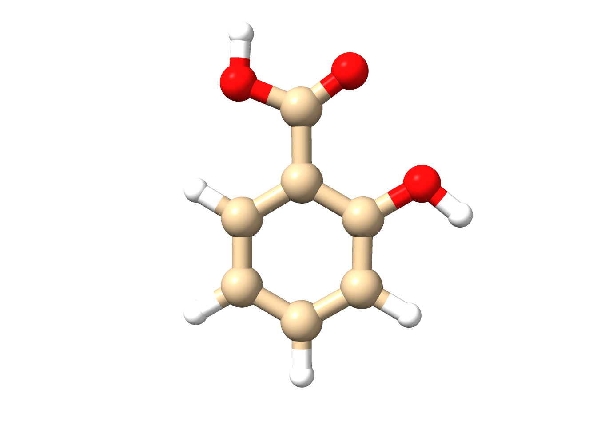
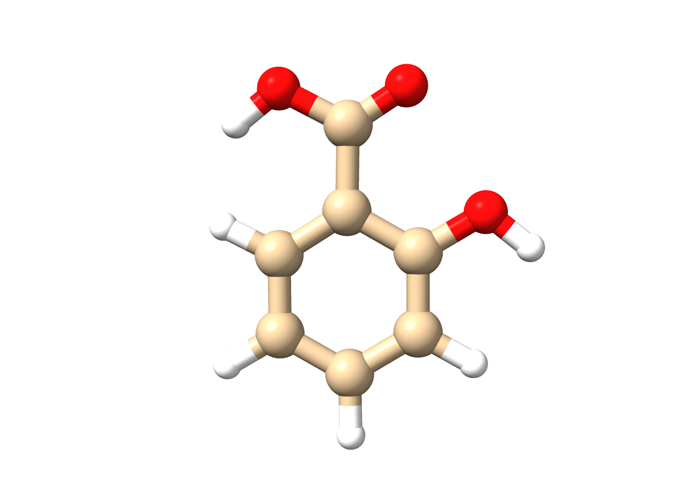
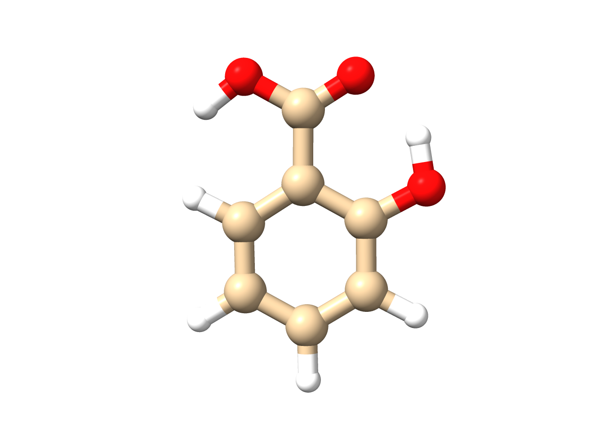
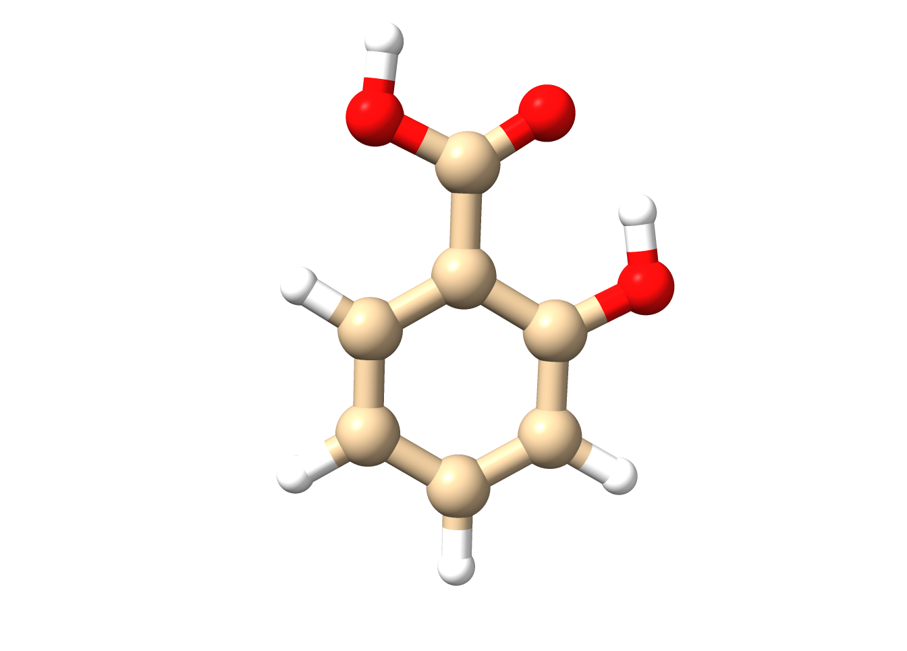
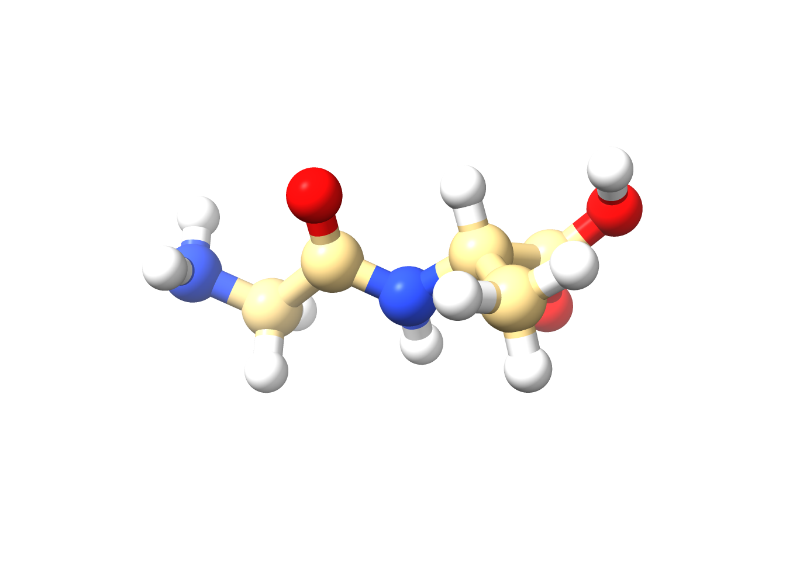
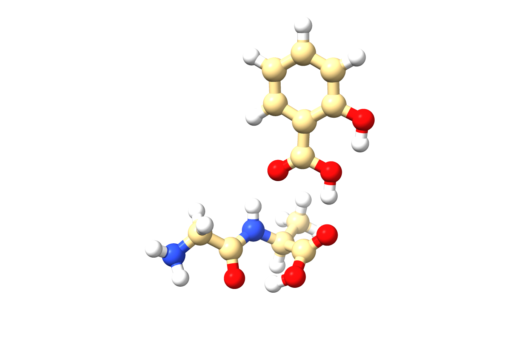
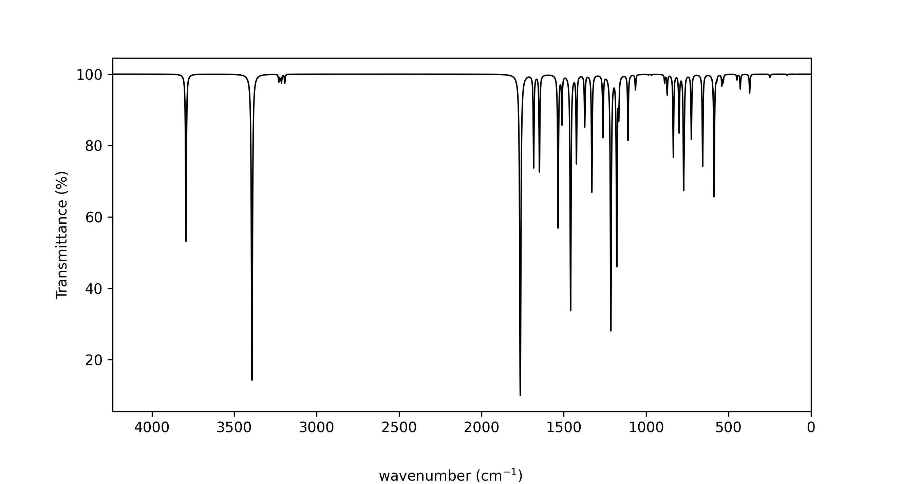
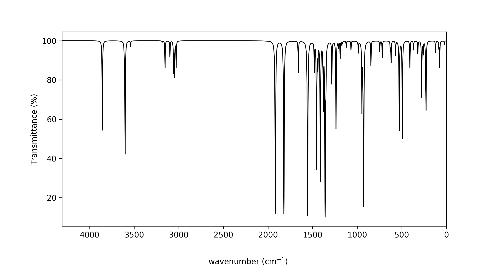
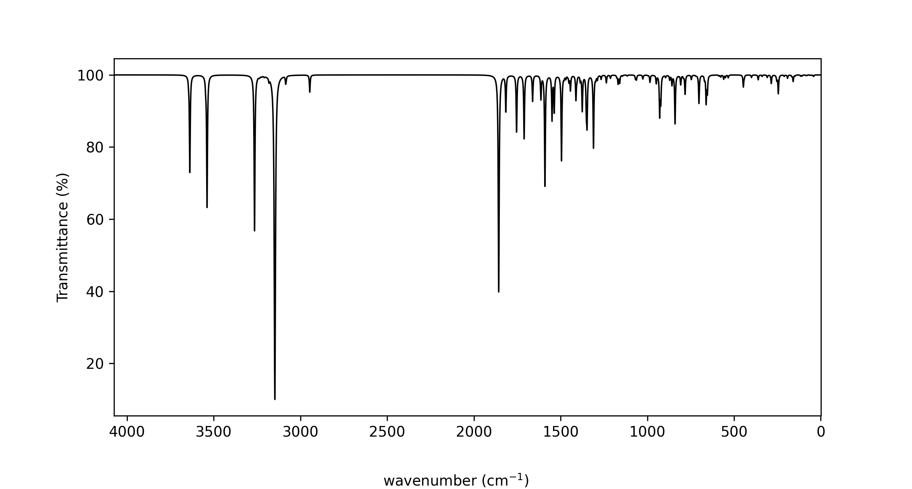

# Workshop Module  
## From GFN2-xTB Screening to DFT Vibrational Analysis  
### Ligand–Peptide Interactions with ORCA and Chemcraft

---

## Module Overview

This workshop module demonstrates a **hierarchical quantum-chemical workflow** for studying ligand–peptide interactions.  
You will combine **semi-empirical tight-binding methods (GFN2-xTB)** with **density functional theory (DFT)** to obtain structural, vibrational, and electronic insights.

The workflow mirrors modern computational chemistry practice and is designed to be:
- Feasible within a short timeframe
- Robust for undergraduate research
- Directly transferable to larger biochemical systems

---

## Learning Objectives

By the end of this module, you should be able to:

- Perform conformational analysis using GFN2-xTB
- Optimize ligand, peptide, and complex geometries
- Refine structures using DFT
- Compute and interpret IR vibrational spectra
- Visualize normal modes and molecular orbitals
- Estimate and interpret complexation energies
- Relate computational results to chemical interactions

---

## Systems Studied

| System | Description |
|------|-------------|
| SA | Salicylic acid (ligand) |
| Dipeptide | Ace–Gly–Ala–Nme |
| SA–Dipeptide | Hydrogen-bonded complex |

---

## Methods Summary

### Semi-empirical stage
- Method: **GFN2-xTB**
- Purpose: fast screening, conformational analysis, geometry preparation
- Environments:
  - Gas phase
  - ALPB implicit water (for SA)

### DFT stage
- Functional: **PBE0**
- Basis set: **def2-SVP**
- Jobs:
  - Geometry optimization
  - Frequency calculation

### Visualization
- **Chemcraft**
  - Geometries
  - IR spectra
  - Normal mode animations
  - Molecular orbitals

---

## Computational Workflow

### Conformational Analysis of Salicylic Acid

**Method**
- GFN2-xTB
- Gas phase and ALPB implicit water

**Goals**
- Identify low-energy conformers
- Observe solvent effects on geometry

**What to record**
- Relative conformer energies
- Key intramolecular hydrogen bonds
- Structural differences between environments

---

### GFN2-xTB Geometry Optimization

**Systems**
- Salicylic acid
- Dipeptide
- SA–Dipeptide complex

  
  
  
  

**Figure 1.** Conformers of Salicylic acid.

  

**Figure 2.** Gly-Ala dipeptide.

  

**Figure 3.** SA-GlyAla complex.

**Goals**
- Obtain stable, reasonable geometries
- Identify favorable ligand–peptide binding orientation

**Checks**
- No imaginary frequencies at this stage
- Reasonable hydrogen-bond distances
- No steric clashes

---

###  DFT Geometry Optimization and Frequencies

**Method**
- PBE0/def2-SVP
- Opt + Freq

**Systems**
- Salicylic acid
- Dipeptide
- SA–Dipeptide complex

**Purpose**
- Accurate vibrational frequencies
- Reliable electronic structure for analysis
---

**Relative Energies of the SA conformers**
| Conformer | GFN2-xTB (kcal/mol) | PBE0/def2-SVP (kcal/mol) |
|-----------|--------------------|--------------------------|
| sa_1 | 0.00 | 0.00 |
| sa_2 | 7.69 | 6.36 |
| sa_3 | -2.10 | -6.36 |
| sa_4 | -8.74 | -12.65 |

**Complexation Energies**
| Energy | Description | GFN2-xTB (kcal/mol) | PBE0/def2-SVP (kcal/mol) |
|----------|-------------|--------------------|--------------------------|
| ΔE | Electronic complexation energy | -7.24 | -17.45 |
| ΔG | Gibbs free energy of complexation | 6.46 | -2.31 |

---

### IR Vibrational Spectra

  
  
  

**Figure 1.** IR Spectrum Comparison of SA (top), dipeptide (mid), and SA-dipeptide complex (bot).

### Complexation Energy

**Definition**

